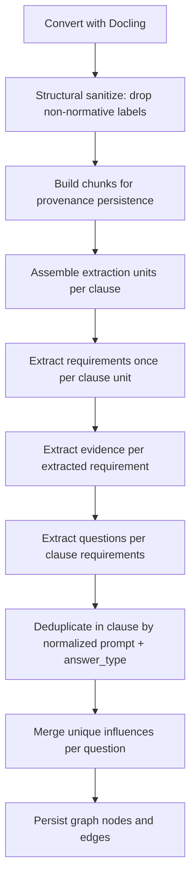

# Clause-Centric Ingest Quality Task Package

## 1) Objective and Scope Lock

This package improves **ingest quality only** and must serve the main concept goal:

- `Norm -> Context -> Action`
- cleaner master graph inputs for context orchestration
- better user-facing requirement/question quality without runtime behavior changes

### In Scope (this implementation)

- Clause-centric extraction units (not chunk-fragment extraction).
- Deterministic noise filtering before extraction.
- Deterministic duplicate question prevention at ingest time.
- Provenance preservation from requirement/question outputs back to source chunks.
- Fresh re-ingest into empty graph and quality verification.

### Out of Scope (explicitly excluded now)

- Cross-document linking (`standard <-> law`, `DocumentSet`, release scoping).
- Session/context graph feature expansion.
- UI/streaming card contract changes.
- New endpoint contracts.

## 2) User-Centric Quality Outcomes

From user perspective, ingest is successful only if:

- clauses and subclauses are represented as meaningful compliance units,
- users do **not** get repeated equivalent questions for the same clause intent,
- requirement cards and evidence hints are clearer and less noisy,
- existing context chat flow continues to work unchanged.

## 3) Target Pipeline (Single Authoritative Path)

## 4) Implementation Scope by File

- `server/app/compliance_graph/pipeline.py` (**primary**)
  - remove chunk-level extraction gating from control flow
  - introduce clause-unit assembly from persisted chunks
  - run extraction once per clause unit
  - dedupe questions at clause-unit scope
  - merge influences deterministically
- `server/app/compliance_graph/schema.py` (**if needed**)
  - keep/adjust constants for deterministic normalization and filtering
- `server/app/compliance_graph/extractor.py` (**only minimal compatibility changes if required**)
  - no feature expansion, no runtime contract changes

No changes to orchestrator API contracts for this task package.

## 5) Deterministic Quality Rules

1. **Structural filter first**
  - use Docling structural labels (`picture`, `chart`, `table`, `caption`, `page_header`, `page_footer`) as primary noise removal.
2. **Clause-unit boundary is authoritative**
  - extraction unit is clause/subclause grouping, not individual chunk.
3. **Subclause granularity preserved**
  - e.g. `7.1.1` and `7.1.2` are separate extraction units.
4. **Duplicate question prevention is ingest-time**
  - one canonical question per clause for same normalized prompt intent and answer type.
5. **Influence dedupe**
  - unique influence key: `ru_key + mode + when_value`.
6. **Provenance retained**
  - chunk persistence and requirement source traceability must remain intact.

## 6) Duplicate Definition (Strict)

The following is a duplicate and must collapse into one question node within a clause unit:

- same `clause_id`
- same normalized `prompt` (whitespace/case/punctuation normalized)
- same `answer_type`

Not a duplicate:

- different intent/question semantics in same clause
- different answer type for a meaningfully different diagnostic purpose

## 7) Acceptance Criteria (Implementation Complete)

### Data Quality Acceptance

- For ISO sample: subclauses (`7.1.1`, `7.1.2`, etc.) are extracted as separate units.
- No figure/table/caption/front-matter artifacts become extraction anchors.
- Same-clause duplicate question artifacts are eliminated by deterministic dedupe.
- Requirement/evidence/question outputs remain language-consistent with root document language.

### Functional Safety Acceptance

- Existing `/chat` context mode continues to stream valid cards.
- Existing progress/counter behavior remains operational.
- No regressions in ingest endpoint response contract.

## 8) Verification Plan (Fresh Re-Ingest Required)

### Test Data

- `data/converted_iso9001.md` equivalent source document ingest
- `data/AStV, Fassung vom 23.03.2026.md` equivalent source document ingest

### Execution

1. Start from empty master graph.
2. Re-ingest ISO document.
3. Re-ingest AStV document.
4. Run validation queries and targeted spot checks.
5. Run context chat smoke flow to ensure non-regression.

### Must-Check Results

- Clause/subclause counts look structurally plausible.
- Requirement distribution per clause is plausible (no obvious fragmentation spikes).
- Zero duplicate same-clause prompts after normalization.
- Question-to-requirement influences remain connected and deduped.

## 9) Non-Regression Checklist

- Ingest endpoint still returns:
  - chunks totals/kept
  - requirements count
  - questions count
  - influences count
  - evidence hints count
- Master graph labels and key relations remain queryable by existing orchestrator logic.
- No new required frontend payload fields.

## 10) Risks and Mitigations

- **Risk:** over-merging semantically distinct prompts during dedupe. **Mitigation:** dedupe key includes `answer_type`; normalization is limited to formatting, not semantic rewriting.
- **Risk:** clause-unit assembly mistakes reduce extraction recall. **Mitigation:** keep ordered chunk concatenation and verify per-clause requirement density.
- **Risk:** hidden dependence on chunk-level extraction in runtime expectations. **Mitigation:** preserve persistence shape and perform context chat smoke tests after re-ingest.

## 11) Deliverables

- Updated ingest pipeline code implementing clause-centric extraction.
- Deterministic question dedupe and influence merge behavior.
- Freshly re-ingested ISO + AStV master graph.
- Verification evidence:
  - summary metrics before/after
  - duplicate checks
  - context mode non-regression smoke result.

## 12) Definition of Done

Done when ingest produces cleaner clause-anchored graph artifacts, same-clause question duplicates are removed, provenance is preserved, and existing user context flow remains fully functional after fresh re-ingest.