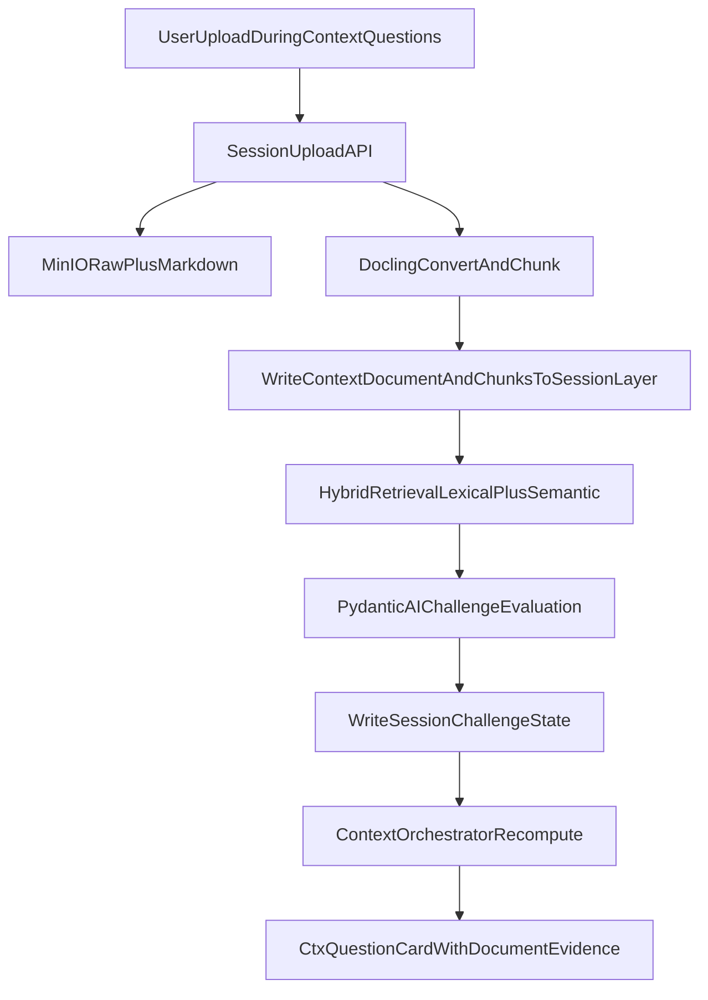

# Context Document Challenge Implementation Plan

## Objective

Implement a new session-scoped context-document capability so each diagnostic question can be challenged against uploaded organization documents (e.g., quality handbook), while preserving the existing architecture invariant: master graph stays curated truth, session graph carries runtime state.

This stage is additive-only: current questionnaire behavior and rendering remain operational when no context document is uploaded or indexed.

## Architecture Scope

- Keep existing master ingestion and context orchestration intact.
- Add a parallel **session context-document pipeline** that feeds question challenge results.
- Keep LLM as interpreter; keep applicability/closure/challenge transitions deterministic in orchestrator.

## Workstream 1: Session Data Model Extension (Neo4j)

- Extend session layer with new labels/relationships (same DB, strict `session_id` partitioning):
  - `ContextDocument` (one upload artifact in a session)
  - `ContextChunk` (Docling chunk with provenance and citation metadata)
  - `HAS_CONTEXT_DOCUMENT`, `HAS_CONTEXT_CHUNK`
  - `MATCHES_REQUIREMENT` (chunk -> requirement candidate link with score/method)
  - `HAS_CHALLENGE_STATE` (session -> requirement state from docs)
- Add deterministic precedence integration between existing `HAS_STATE` and new challenge state:
  - recommended effective order: `not_applicable` > `gap` > `unclear` > `addressed` > `open`
  - challenge state can promote `gap/unclear/addressed`, but cannot override `not_applicable`.
- Add indexes/constraints for `context_document_id`, `context_chunk_id`, `(session_id, ru_key)` effective-state integrity.
- Persist citation-grade chunk metadata required by card rendering:
  - `page_no` (or page range where available)
  - `heading_path` / section path from Docling metadata
  - `source_ref` / span reference
  - `meta_json` (serialized raw Docling chunk metadata for audit/debug)

Primary files to change:

- [server/app/compliance_graph/context_orchestrator.py](server/app/compliance_graph/context_orchestrator.py)
- [server/app/compliance_graph/context_contract.py](server/app/compliance_graph/context_contract.py)
- [docs/compliance_graph_neo4j_schema.md](docs/compliance_graph_neo4j_schema.md)

## Workstream 2: Upload Step in Context Questionnaire

- Add a new context question just before standards selection (current anchor: `context.org_selected_standards`):
  - new key: `context.org_handbook_upload` (or equivalent)
  - new answer type: `file_upload` (or controlled upload action metadata)
- Keep UX deterministic:
  - upload starts async ingest job
  - card displays processing status
  - questionnaire may continue while indexing finalizes
- Persist upload linkage into session profile (`context_profile_json`) as document IDs + ingest status.

Primary files to change:

- [server/app/compliance_graph/context_orchestrator.py](server/app/compliance_graph/context_orchestrator.py)
- [server/app/compliance_graph/context_contract.py](server/app/compliance_graph/context_contract.py)
- [client/components/context-question-jsx.tsx](client/components/context-question-jsx.tsx)
- [client/components/chat-interface.tsx](client/components/chat-interface.tsx)

## Workstream 3: Session Context-Document Ingest Pipeline

- Build a dedicated ingest service for session uploads (do not reuse master `NormativeDocument` writes):
  1. receive file + `session_id`
  2. store raw file (MinIO)
  3. Docling convert + hierarchical chunking
  4. sanitize/filter non-normative noise
  5. persist `ContextDocument` + `ContextChunk` into session layer with page/section metadata
  6. index chunks in Qdrant collection(s) scoped by `session_id` and `context_document_id`
  7. emit job status for UI/orchestrator polling
- Reuse existing conversion principles from master pipeline for consistency and provenance shape.
- Vectorization boundary (explicit):
  - vectorize uploaded context chunks only (during ingest/indexing)
  - do not vectorize JSX/card markup

Primary files to add/extend:

- [server/app/compliance_graph/pipeline.py](server/app/compliance_graph/pipeline.py) (extract reusable chunk/provenance helpers)
- [server/app/compliance_graph/router.py](server/app/compliance_graph/router.py) (new session upload route)
- [server/app/sources/router.py](server/app/sources/router.py) (optional integration path if reused)

## Workstream 4: Retrieval Strategy (Qdrant-First Hybrid Retrieval)

- Implement **hybrid retrieval** per question/requirement:
  - Dense + sparse retrieval in Qdrant for `ContextChunk` candidates
  - Deterministic fusion/rerank with stable tie-breaks
  - Retrieve top-k chunk candidates per active question/requirement
- Query-construction contract (at question-card render/recompute time):
  - build retrieval query from `DiagnosticQuestion.prompt`
  - include linked `RequirementUnit.statement` (and optional RU title/clause heading)
  - optionally include selected context profile facets as rerank hints
- Store retrieval evidence for traceability: top chunk IDs, retrieval method, scores, and citation metadata.
- Keep existing functionality intact:
  - if no indexed context docs exist, skip challenge retrieval and render existing card output unchanged

Primary files:

- [server/app/compliance_graph/context_orchestrator.py](server/app/compliance_graph/context_orchestrator.py)
- [server/app/compliance_graph/context_assist.py](server/app/compliance_graph/context_assist.py) (if shared model calling utility is reused)

## Workstream 5: Challenge Evaluator and State Materialization

- Add a strict evaluator contract per `(question, requirement, retrieved_chunks)`:
  - outputs: user-facing `challenge_state` (`compliant|needs_improvement|insufficient_evidence`), `confidence`, `rationale`, `citations`
  - use Pydantic AI structured output with deterministic post-validation
- Deterministic state mapping to existing runtime state model:
  - `compliant` -> `addressed`
  - `needs_improvement` -> `gap`
  - `insufficient_evidence` -> `unclear`
- Materialize both views:
  - business-facing challenge state (for card section)
  - mapped engine state (for counters/progress/effective requirement state)
- Materialize session evidence/challenge edges and integrate into progress counters and completion logic.
- Update question briefing payload to include a new additive section with:
  - top 3 correlated context chunks
  - document name, page, section heading/path
  - per-chunk verdict rationale and confidence
  - explicit citation-ready references (`chunk_key`, page, heading)

Primary files:

- [server/app/compliance_graph/context_contract.py](server/app/compliance_graph/context_contract.py)
- [server/app/compliance_graph/context_orchestrator.py](server/app/compliance_graph/context_orchestrator.py)
- [client/components/context-question-jsx.tsx](client/components/context-question-jsx.tsx)

## Workstream 6: API Contracts and Endpoints

- Add server routes:
  - `POST /api/compliance-graph/context-documents/upload` (session upload)
  - `GET /api/compliance-graph/context-documents/{id}/status`
  - optional debug: `GET /api/compliance-graph/sessions/{session_id}/context-evidence`
- Extend existing context turn payload schema to carry file-upload references and status updates.
- Keep backward compatibility for existing context interactions (`answer`, `assist`, `control`).

Primary files:

- [server/app/compliance_graph/router.py](server/app/compliance_graph/router.py)
- [server/app/chat/router.py](server/app/chat/router.py)
- [server/app/main.py](server/app/main.py)

## Workstream 7: Dependency Decision Matrix

- Keep as native as possible first:
  - already used: `docling`, `pydantic_ai`, `neo4j`.
- Qdrant-first retrieval stack (preferred baseline for this stage):
  - `qdrant-client` (required)
  - `fastembed` (or `fastembed-gpu` where hardware is available) for local embedding generation used by Qdrant client
- Dependency gate:
  - start with one vector stack only (Qdrant hybrid dense+sparse)
  - avoid parallel retrieval stacks (`faiss`, separate Neo4j vector path) in this stage
- Optional future alternatives (deferred):
  - provider-side embedding APIs via model provider abstraction if local embedding runtime is not preferred

## Workstream 8: Test, Validation, and Rollout

- Unit tests:
  - answer type `file_upload` validation
  - ingest idempotency + session partition safety
  - retrieval ranking determinism
  - challenge-state precedence and recompute behavior
- Integration tests:
  - full flow: context facts -> upload -> challenge-enhanced question cards
  - resume session with already indexed context docs
  - stale/failed ingest status handling
  - no-upload/no-index fallback keeps existing questionnaire behavior unchanged
- Graph validation queries:
  - context document/chunk counts per session
  - citation traceability from challenge state to chunk
  - effective state counters consistency
  - page/section metadata completeness for cited chunks
- Rollout strategy:
  - feature flag `context_document_challenge_enabled`
  - shadow mode first (compute challenge but don’t affect effective state)
  - then enforce challenge state in active counters.

Primary docs to update:

- [docs/compliance_graph_session_stage_implementation.md](docs/compliance_graph_session_stage_implementation.md)
- [docs/compliance_graph_endpoint_poc_implementation.md](docs/compliance_graph_endpoint_poc_implementation.md)
- [docs/graph_validation_queries.md](docs/graph_validation_queries.md)

## Deliverables

- Session-scoped context document ingest and storage model
- Upload-capable context question step
- Qdrant hybrid retrieval + structured challenge evaluator
- Deterministic effective-state integration and progress counters
- Updated JSX cards with additive document-grounded evidence section (including citation metadata)
- Validation queries and rollout safeguards

